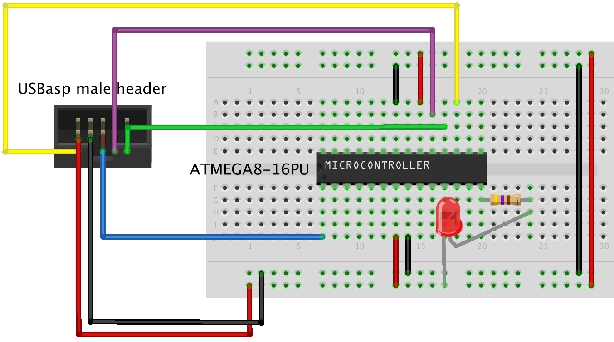

ATMEGA8-16PU
==================================================================
Programming ATMEGA8-16PU with USBasp using AVRdude on OSX

Wiring
--------------------------------------

Components / Software
--------------------------------------
- Atmel ATMEGA8-16PU
- 470 Ohm Resistor
- LED
- Jumper Wires
- USBasp AVR Programmer
- Breadboard
- AVRdude (Cross Compile Toolchain for AVR development)

Steps
--------------------------------------
- Compile the blink.c source code to .obj by executing
	- avr-gcc -mmcu=atmega8 -Wall -Os -o blink.elf blink.c
- Convert the .obj into Intel HEX by executing
	- avr-objcopy -j .text -j .data -O ihex blink.elf blink.hex
- Connect the USBasp into usb port of the host computer and execute
	- avrdude -c usbasp -p m8 -e -U flash:w:blink.hex

Debug
--------------------------------------
- Checking microcontroller USBasp connection
	- avrdude -c usbasp -p m8
	- Outputs
		avrdude: warning: cannot set sck period. please check for usbasp firmware update.
		avrdude: AVR device initialized and ready to accept instructions

		Reading | ################################################## | 100% 0.00s

		avrdude: Device signature = 0x1e9307

		avrdude: safemode: Fuses OK (H:FF, E:D9, L:E1)

		avrdude done.  Thank you.

- Flashing output
	- 	avrdude: warning: cannot set sck period. please check for usbasp firmware update.
		avrdude: AVR device initialized and ready to accept instructions

		Reading | ################################################## | 100% 0.00s

		avrdude: Device signature = 0x1e9307
		avrdude: erasing chip
		avrdude: warning: cannot set sck period. please check for usbasp firmware update.
		avrdude: reading input file "blink.hex"
		avrdude: input file blink.hex auto detected as Intel Hex
		avrdude: writing flash (90 bytes):

		Writing | ################################################## | 100% 0.07s

		avrdude: 90 bytes of flash written
		avrdude: verifying flash memory against blink.hex:
		avrdude: load data flash data from input file blink.hex:
		avrdude: input file blink.hex auto detected as Intel Hex
		avrdude: input file blink.hex contains 90 bytes
		avrdude: reading on-chip flash data:

		Reading | ################################################## | 100% 0.04s

		avrdude: verifying ...
		avrdude: 90 bytes of flash verified

		avrdude: safemode: Fuses OK (H:FF, E:D9, L:E1)

		avrdude done.  Thank you.

Links
--------------------------------------
- http://hackaday.com/2010/10/23/avr-programming-introduction/
- http://www.micahcarrick.com/tutorials/avr-microcontroller-tutorial/getting-started.html
- https://www.youtube.com/watch?v=BPxgv2PXGw8

